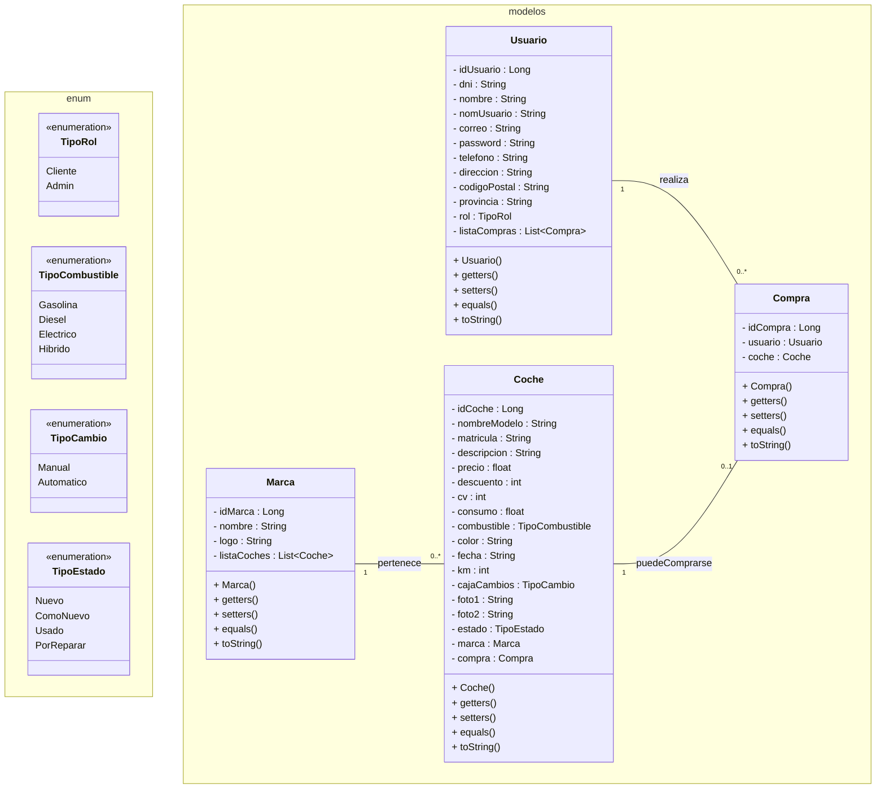

# 🚗 ToniCar – Catálogo Web de Vehículos

**ToniCar** es una aplicación web desarrollada como proyecto académico para la asignatura **Desarrollo de Aplicaciones Web (DAW)**.  
El objetivo es simular el funcionamiento de un **concesionario online**, permitiendo consultar un catálogo de coches, gestionar usuarios y enviar solicitudes de información mediante una arquitectura **MVC** basada en **Java EE / Jakarta EE**.

---

## 📌 Funcionalidades

- Catálogo de vehículos con vista de detalle.
- Página principal con carousel informativo.
- Registro e inicio de sesión de usuarios.
- Gestión de sesión con `HttpSession`.
- Acceso restringido según autenticación.
- Envío de solicitudes de información.
- Separación de responsabilidades (Modelo–Vista–Controlador).

---

## 🗂️ Diagrama de Clases

El siguiente diagrama representa las entidades principales del sistema y sus relaciones (Persistencia con JPA/EclipseLink):

---

## 🧱 Arquitectura (MVC)

### Modelo
- Entidades: `Usuario`, `Coche`, `Marca`, `Compra`
- Utilidades de conexión a base de datos.

### Controlador
- **Servlets** para gestionar peticiones HTTP.
- Validación de datos y control de navegación.

### Vista
- **JSP** con **JSTL** y **EL**.
- Componentes reutilizables (`header`, `footer`).
- Interfaz responsive con **Bootstrap**.

---

## 🛠️ Tecnologías

### Frontend:

- HTML5
- CSS3 para el estilo visual de la web
- JavaScript para la validación de datos.
- Bootstrap v5.3.8 para un diseño responsivo.
- Plantillas JSP para reutilizar encabezados, menús y pies de página en las diferentes vistas.
- JSTL para renderizar contenido dinámico en tablas y tarjetas.

### Backend:

- Java 21 (Jakarta EE 10)
- Servlets para los controladores.
- JSP como tecnología de las vistas.
- JSTL y expresiones EL para la parte dinámica (comunicación entre los controladores y las vistas).
- JavaDB/Java Derby como base de datos.
- JDBC para la comunicación con la base de datos.
- EclipseLink como ORM (mapeo objeto-relacional) que implementa JPA (Java Persistence API) como proveedor de persistencia (para manejar la unidad de persistencia).
- Gestión de sesiones HTTP con HttpSession.

### Servidor y Entorno de desarrollo (IDE):

- Eclipse GlassFish v7.0.14 como servidor de aplicaciones web (servidor local)
- NetBeans 22 como IDE
- Arquitectura MVC (Modelo-Vista-Controlador)
---

## ▶️ Ejecución

1. Importar el proyecto en **NetBeans**.
2. Configurar **Eclipse GlassFish**.
3. Crear la base de datos y cargar el script SQL.
4. Ajustar credenciales de BD en la clase de conexión.
5. Ejecutar el proyecto desde NetBeans.

---

## 🎓 Objetivo Académico

- Aplicar el patrón MVC en aplicaciones web Java.
- Implementar autenticación y gestión de sesiones.
- Separar lógica de negocio y presentación.
- Desarrollar una aplicación web funcional y mantenible.

---

## 📑 Documentación y Memoria Técnica del Proyecto

> **Nota:** Haz clic en el botón de arriba para visualizar o descargar la memoria técnica completa en PDF.

---

## 👤 Autor

**Antonio Abad Hernández Gálvez**
* GitHub: [@antonioabadpro](https://github.com/antonioabadpro)
* *Proyecto realizado para la Universidad de Huelva (UHU)*

---

## ©️​ Licencia y Derechos de Autor

**© 2025. Antonio Abad Hernández Gálvez**.  
Todos los derechos reservados.

Este proyecto es propiedad intelectual de su autor.  
El código se proporciona únicamente con fines de **consulta y demostración de portfolio**.

El código fuente de este proyecto es propiedad exclusiva de su autor. 
Se permite su visualización con fines educativos y de evaluación académica.

⛔ **Prohibido su uso:** Queda estrictamente prohibida su reproducción total o parcial, modificación, distribución o uso para fines comerciales o académicos por parte de terceros sin la autorización expresa y por escrito del autor.

Este proyecto es el resultado de una evaluación académica para la Universidad de Huelva.  
El plagio o uso indebido de este código en otros proyectos académicos será reportado.
